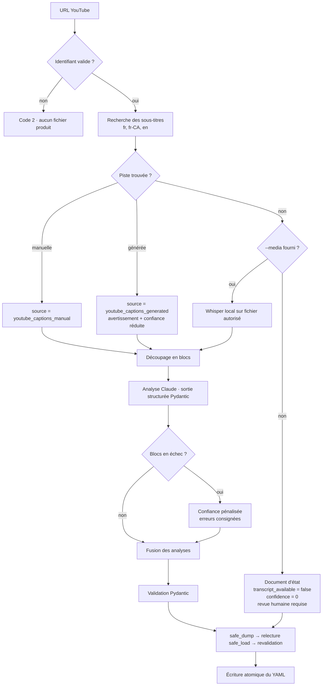

# YouTube Knowledge Structurer (YKS)

[](https://github.com/Preventera/youtube_knowledge_structurer/actions/workflows/ci.yml)
[](https://www.python.org/)
[](LICENSE)

Transforme le contenu **accessible** d'une vidéo YouTube en document YAML structuré, validé et traçable.

Principe de conception central :

> Le modèle d'IA n'est pas la source. La transcription est la source.
> L'IA ne fait qu'extraire et structurer ce qui est soutenu par la transcription.
> Toute donnée absente, ambiguë ou non vérifiable est signalée.

## Ce que fait l'agent

1. Extrait et valide l'identifiant de la vidéo.
2. Récupère les sous-titres accessibles, en privilégiant le français (`fr`, `fr-CA`, puis `en`).
3. Distingue les sous-titres manuels des sous-titres générés automatiquement, et pénalise la confiance dans le second cas.
4. Analyse le transcript avec Claude via LangChain, en sortie structurée Pydantic.
5. Extrait résumé, thèmes, points clés, recommandations, risques, personnes, organisations, technologies et affirmations vérifiables.
6. Conserve les horodatages et les preuves textuelles.
7. Attribue un niveau de confiance à chaque élément important.
8. Produit un YAML cohérent, en UTF-8, dans l'ordre du schéma.
9. Signale explicitement les informations absentes ou incertaines.
10. Utilise Whisper local **uniquement** si un fichier média autorisé est fourni avec `--media` et qu'aucun sous-titre n'existe.

## Ce que l'agent ne fait pas, par conception

- Il ne télécharge aucune vidéo ni aucun flux audio distant.
- Il ne contourne aucune protection, restriction d'accès ni droit d'utilisation.
- Il n'appelle pas le modèle d'analyse quand il n'y a pas de transcription : sans source, il n'y a pas de résumé.
- Il ne demande jamais au modèle d'écrire du YAML libre.
- Il n'utilise jamais `yaml.load` ni `yaml.dump` non sûrs.

## Installation

```bash
python -m venv .venv
source .venv/bin/activate          # Windows : .venv\Scripts\activate
pip install -r requirements.txt
pip install -e .                   # installe la commande "yks"
```

Sans `pip install -e .`, préfixez les commandes par `PYTHONPATH=src` (Windows :
`set PYTHONPATH=src`) et utilisez `python -m yks.cli`.

Repli local de transcription (facultatif) :

```bash
pip install faster-whisper
```

Copiez `.env.example` vers `.env` et renseignez votre clé :

```
ANTHROPIC_API_KEY=votre_cle
YKS_MODEL=claude-sonnet-5
```

Le nom du modèle est configurable ; vérifiez la liste courante dans la
[documentation des modèles](https://docs.claude.com/en/docs/about-claude/models/overview).

## Utilisation

```bash
yks "https://www.youtube.com/watch?v=VIDEO_ID" \
  --languages fr fr-CA en \
  --output resultat.yaml
```

Avec un média local dont vous avez le droit d'usage, en repli :

```bash
yks "https://www.youtube.com/watch?v=VIDEO_ID" \
  --media ./reunion.mp4 \
  --whisper-model small \
  --output resultat.yaml
```

Options utiles :

| Option | Effet |
| --- | --- |
| `--include-segments` | Inclut tous les segments horodatés dans le YAML (fichier volumineux, utile pour l'audit) |
| `--rights-note` | Consigne la base légale ou l'autorisation d'utilisation dans `video.rights_note` |
| `--force` | Autorise l'écrasement du fichier de sortie |
| `--print-schema document` | Affiche le schéma JSON complet et quitte |
| `--chunk-characters` | Ajuste la taille des blocs envoyés au modèle |

## Arbre de décision



## Codes de sortie

| Code | Signification | YAML produit |
| --- | --- | --- |
| 0 | Succès | Analyse complète |
| 2 | URL ou identifiant invalide | Non |
| 3 | Vidéo indisponible ou d'accès restreint | Document d'état |
| 4 | Sous-titres désactivés | Document d'état |
| 5 | Aucune piste dans les langues demandées | Document d'état |
| 6 | Transcription vide | Document d'état |
| 7 | Récupération refusée (blocage, limitation) | Document d'état |
| 10-11 | Média local absent ou de format invalide | Document d'état |
| 12-14 | Whisper non installé, en erreur, ou ressources insuffisantes | Document d'état |
| 20 | Clé d'API absente | Document d'état |
| 21-22 | Erreur du modèle ou sortie non conforme | Document d'état |
| 30-32 | YAML invalide, écriture impossible, fichier existant | Non |

Un code différent de 0 accompagné d'un fichier signifie que le YAML **documente un échec** : il ne contient aucune analyse du contenu.

## Structure du projet

```
youtube_knowledge_structurer/
├── pyproject.toml            # métadonnées, dépendances, point d'entrée "yks"
├── requirements.txt
├── .env.example
├── README.md
├── examples/                 # YAML complet, partiel, sans transcription, en erreur
├── src/yks/
│   ├── cli.py                # interface en ligne de commande, codes de sortie
│   ├── config.py             # paramètres et secrets par variables d'environnement
│   ├── errors.py             # hiérarchie d'exceptions et codes de sortie
│   ├── models.py             # modèles Pydantic v2 du document
│   ├── fallback.py           # documents d'état et motifs de revue humaine
│   ├── pipeline.py           # orchestration complète
│   ├── logging_setup.py
│   ├── ingestion/
│   │   ├── url.py            # extraction et validation de l'identifiant
│   │   └── captions.py       # sous-titres accessibles, erreurs typées
│   ├── transcription/
│   │   ├── segments.py       # normalisation, hash SHA-256, qualité
│   │   └── whisper_local.py  # repli local, fichier autorisé uniquement
│   ├── analysis/
│   │   ├── chunking.py       # découpage avec recouvrement
│   │   ├── prompts.py        # prompts anti-hallucination en balises XML
│   │   └── analysis_chain.py # chaîne LangChain + fusion
│   └── export/
│       └── export_yaml.py    # safe_dump, aller-retour, écriture atomique
└── tests/                    # 126 tests, aucun appel réseau
```

## Tests et qualité

```bash
pip install -r requirements-dev.txt
pre-commit install          # facultatif : lint et détection de secrets avant chaque commit

pytest                      # 126 tests, hors ligne
pytest --cov=yks --cov-report=term-missing
ruff check . && ruff format --check .
mypy src/yks
```

Aucun test unitaire n'appelle YouTube, l'API Claude ou Whisper : les frontières externes sont injectées (`captions_fetcher`, `runner`, `model_loader`). Aucune clé d'API n'est donc requise pour exécuter la suite, ni en local ni en intégration continue.

## Intégration continue

Le workflow `.github/workflows/ci.yml` exécute quatre travaux à chaque push et chaque pull request :

| Travail | Contenu |
| --- | --- |
| `tests` | pytest sur Python 3.11, 3.12 et 3.13 sous Linux, plus 3.12 sous Windows, avec couverture |
| `qualite` | `ruff check` et `mypy src/yks` |
| `schema` | chaque fichier de `examples/` est relu et revalidé contre le schéma courant |
| `secrets` | échoue si `.env` est versionné ou si une clé `sk-ant-...` apparaît dans le dépôt |

Le job `schema` est le garde-fou le plus utile : il casse dès qu'un changement de modèle Pydantic rend les exemples publiés invalides, ce qui signale une rupture pour les systèmes qui consomment le YAML.

Voir [CONTRIBUTING.md](CONTRIBUTING.md) pour les règles de contribution et [SECURITY.md](SECURITY.md) pour le signalement de vulnérabilités.

## Gouvernance et sécurité

- **Traçabilité.** Chaque point clé porte un horodatage, une preuve textuelle courte et un score de confiance. Le bloc `quality` conserve la méthode d'extraction, le modèle utilisé, le nombre de blocs, les avertissements et les erreurs.
- **Revue humaine.** `human_review_required` passe à `true` automatiquement dès qu'un domaine sensible est détecté (juridique, médical, SST, réglementaire, financier), que des renseignements personnels sont possibles, qu'un bloc a échoué ou que la confiance descend sous 0,6. Le champ `review_reason` explique pourquoi.
- **Renseignements personnels.** `contains_personal_data` est renseigné par l'analyse. Pour un contenu réellement sensible, envisagez un modèle hébergé dans votre juridiction plutôt qu'une API externe, et conservez la transcription source séparément du YAML diffusé.
- **Secrets.** La clé d'API n'est lue que depuis l'environnement, jamais journalisée, jamais écrite dans le YAML.
- **Sécurité YAML.** `safe_dump`/`safe_load` exclusivement, alias et ancres désactivés, champs inconnus refusés par `extra="forbid"`, relecture et revalidation après écriture.
- **Écriture atomique.** Fichier temporaire puis `os.replace` : une interruption ne peut pas laisser un YAML tronqué. `--force` est exigé pour écraser un fichier existant.
- **Idempotence.** Le hash SHA-256 de la transcription permet de détecter qu'une vidéo a déjà été traitée sans la réanalyser.
- **Injection par le contenu.** La transcription est encadrée par une balise `<transcript>` et le prompt système interdit explicitement de suivre toute consigne qui s'y trouverait.

## Limites connues

- `youtube-transcript-api` s'appuie sur une partie non documentée de l'interface de YouTube : son comportement peut changer, et les adresses IP infonuagiques sont fréquemment bloquées. Prévoyez un repli et surveillez le code de sortie 7.
- Les métadonnées riches (titre, chaîne, date, durée) ne sont pas récupérées par défaut. Pour les obtenir, ajoutez un appel à l'API YouTube Data v3 avec votre propre clé et alimentez les champs correspondants de `VideoInfo`, qui sont déjà prévus.
- L'analyse ne porte que sur la parole transcrite : rien de ce qui est uniquement visible à l'écran n'est capté.
- Les scores de confiance sont produits par un modèle de langage. Ils indiquent une incertitude relative, pas une probabilité calibrée.

## Déploiement local reproductible

```bash
git clone <votre-dépôt> && cd youtube_knowledge_structurer
python -m venv .venv && source .venv/bin/activate
pip install -r requirements-dev.txt
cp .env.example .env            # puis renseigner ANTHROPIC_API_KEY
pytest                          # doit passer intégralement, hors ligne
yks --print-schema document > schema_document.json
yks "https://www.youtube.com/watch?v=VIDEO_ID" -o resultat.yaml
```
